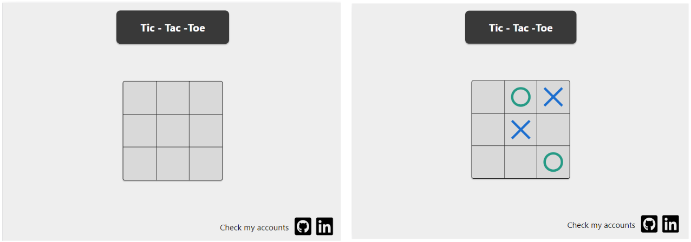
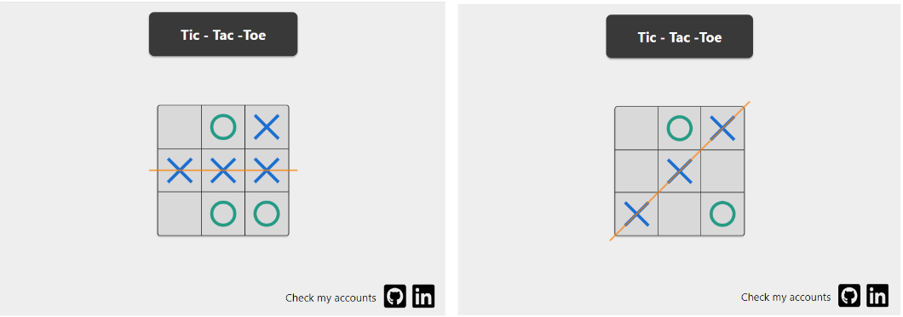
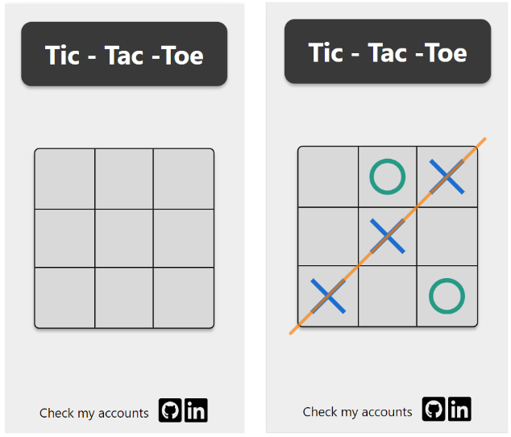
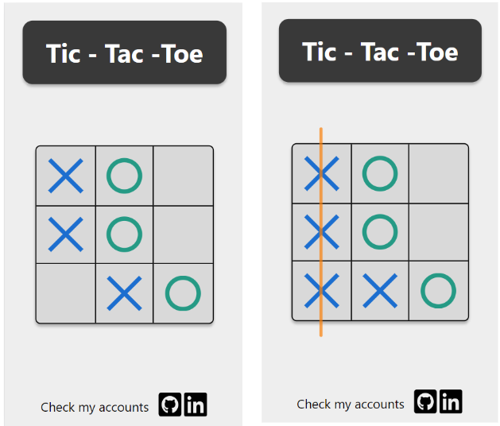

# Tic--Tac--Toe

This is a web application featuring the popular tic-tac-toe game.

## See the website

You can see the website if you click in the [Link](https://weronikaczepiela.github.io/tic---tac--toe/)

## Description

In this application, the user can play a game of tic-tac-toe with the computer. The user has a cross symbol and the computer has a circle. When the same symbol appears in one line the game is finished. Then a line appears on the screen crossing out the winning combination of symbols, and then the board is cleared.

## Features

* Clicking on an empty array element puts a new symbol there.

* After some time, the computer's answer will appear on the board. Until this point, the game is blocked, and making another move is impossible.

* When the same symbol is in one line - vertical, horizontal, or diagonal, then a dash appears on the screen crossing out the winning combination. The board is then automatically cleared.

* When you click on the graphics at the bottom of the page, the author's account opens in a new tab.

##  Application layout

* Web application at the beginning and during the game.

* Web application when the game is over

* Mobile version at the beginning and end of the game

* Mobile version during and at the end of the game.

## How to run?

`npm run start` to start project 